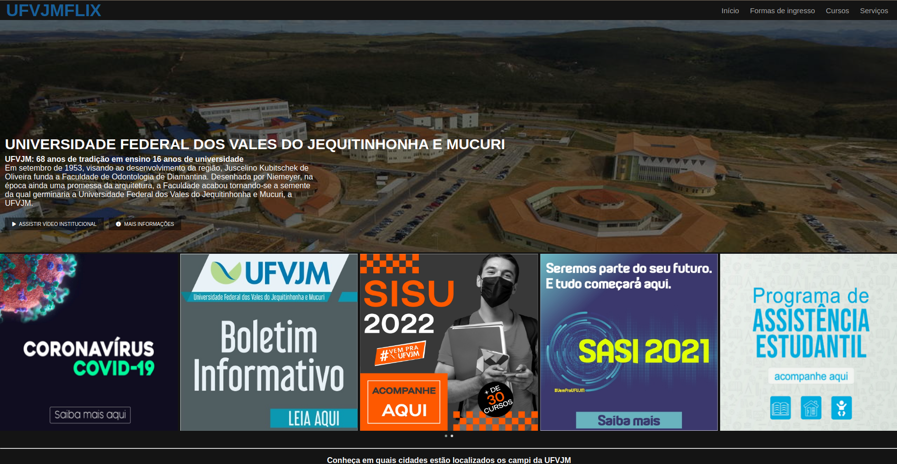

# DESAFIO---Recriando-a-Interface-do-Netflix
Descrição do Desafio Recrie a interface do principal site de streaming mundial utilizando tecnologias simples como HTML5, CSS3 e JavaScript. Nesse projeto você aprenderá: como estruturar um layout, técnicas de CSS3 com containers e variáveis, como posicionar os elementos com Flexbox e como utilizar plugins JQuery a favor da sua aplicação.  Dica: você pode dar um "fork" no repositório disponibilizado pelo expert para organizar melhor as suas alterações e evoluções, mantendo uma referência direta ao código original.

Digital Innovation One
**Instrutor:** Felipe Aguiar

#### Por que UFVJMFLIX?
Porque a UFVJM foi e está sendo a base para o meu aprendizado acadêmico, pessoal e profissional.

#### Resultado

#### Detalhes:

1. Existe interação nos elementos da "nav", nos dois botões principais e ao clicar nas imagens do carrosel.

2. Foi criado duas estrutura de carrosel com as mesmas configurações básicas.

3. Coloquei a tag "hr" para quebrar um tópico.

4. Defini um rodapé para a página como forma de deixar as referências usadas nesse desafio.
  - Meu e-mail
  - LinkedIn
  - GitHub
  - GitHub: Projeto clone que eu fiz com a instrução do Felipe Aguiar
  - GitHub: Projeto do instrutor Felipe Aguiar
  - Onde eu consegui a imagem principal da página
  - Portal da UFVJM onde eu consegui todas as informações para inserir na página.